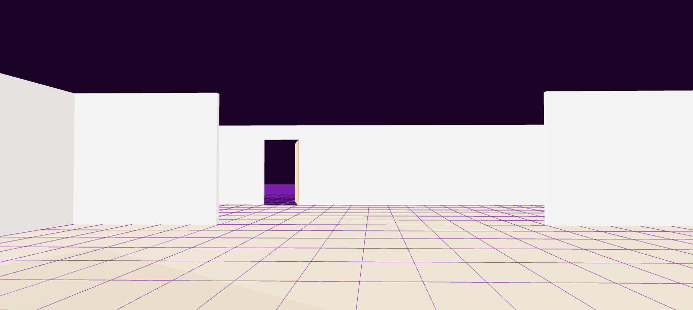
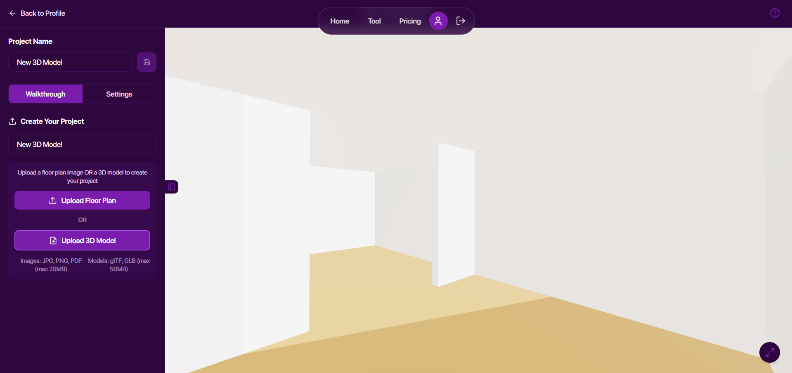
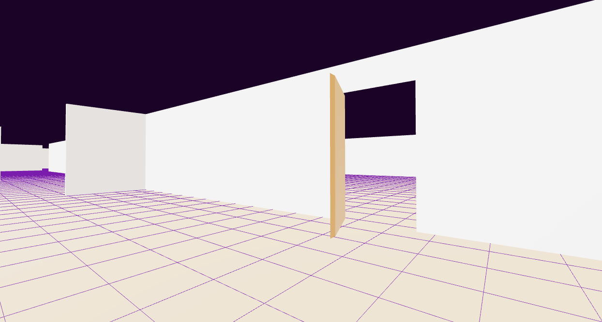
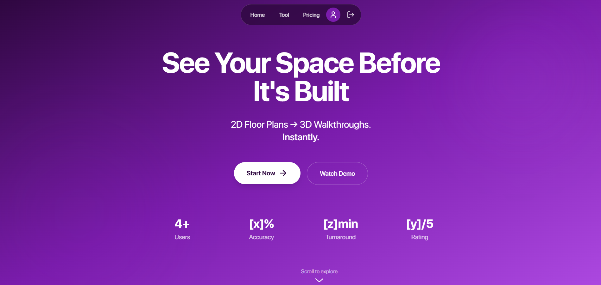
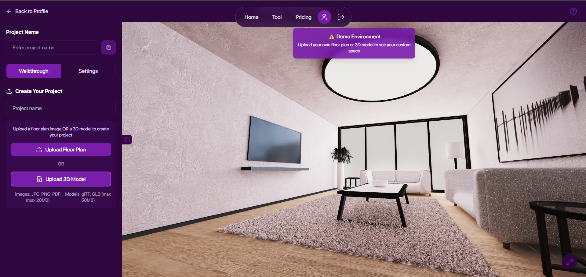

# 3D First person view, Walkthrough

## Overview

A comprehensive web-based 3D visualization platform that transforms static floor plans and architectural models into immersive, navigable virtual environments. Built with modern web technologies, this application enables users to upload floor plan images or 3D models and experience them through realistic first-person walkthrough navigation or strategic top-down perspectives.

## Application Screenshots

<div align="center">
  <table>
    <tr>
      <td align="center">
        
        <br><strong>Generic model</strong>
      </td>
      <td align="center">
        
        <br><strong>New model with roof in script</strong>
      </td>
    </tr>
    <tr>
      <td align="center">
        
        <br><strong>First Person Walkthrough doors</strong>
      </td>
      <td align="center">
        
        <br><strong>Landing</strong>
      </td>
    </tr>
    <tr>
      <td align="center" colspan="2">
        
        <br><strong>Demo fallback</strong>
      </td>
    </tr>
  </table>
</div>

## Core Features

### Dual Viewing Modes
- **First-Person Walkthrough**: Navigate spaces using WASD controls with physics-based movement including gravity, collision detection, and jumping mechanics
- **Top-Down Overview**: Strategic bird's-eye view with smooth camera transitions and orbit controls for comprehensive spatial analysis

### Interactive Model Management
- **File Upload Support**: Compatible with floor plan images (JPG, PNG, PDF) and 3D models (glTF, GLB formats)
- **Automatic Model Processing**: Intelligent centering, scaling, and floor alignment of uploaded 3D content
- **Real-time Model Rotation**: Interactive 360-degree rotation with smooth mathematical easing functions
- **Progressive Loading**: Visual progress indicators during model processing

### Advanced Navigation Controls
- **Physics-Based Movement**: Realistic gravity simulation and collision detection for authentic spatial navigation
- **Adaptive Controls**: Automatic fallback to orbit controls when pointer lock is unavailable
- **Mobile Optimization**: Touch-friendly controls and responsive design for various screen sizes
- **Fullscreen Mode**: Immersive viewing experience with browser fullscreen API integration

### Project Management System
- **User Authentication**: Secure account creation and management through Firebase Authentication
- **Cloud Storage**: Persistent project saving with Firebase Storage integration
- **Project Retrieval**: Load and continue working on previously saved projects
- **Demo Environment**: Default 3D environment available for immediate exploration

## Technical Architecture

### Frontend Technologies
- **React 18** - Component-based UI with modern hooks pattern
- **TypeScript** - Type-safe development with comprehensive interface definitions
- **Three.js** - Advanced 3D rendering engine via react-three-fiber
- **React Three Drei** - Extended Three.js components and utilities
- **Tailwind CSS** - Utility-first styling with dark mode support
- **Framer Motion** - Smooth animations and transitions

### Backend Integration
- **Firebase Authentication** - Secure user account management
- **Firebase Storage** - Scalable file storage for models and floor plans
- **Firebase Firestore** - Real-time database for project metadata
- **Firebase Hosting** - Production deployment platform

### Performance Optimizations
- **Dynamic Model Loading** - Efficient memory management for 3D resources
- **Progressive Enhancement** - Core functionality with enhanced features where supported
- **Responsive Design** - Adaptive interface for desktop and mobile devices
- **Error Boundaries** - Graceful error handling with fallback rendering

## Mathematical Framework

The platform employs sophisticated mathematical algorithms for spatial navigation:

- **Physics Simulation**: Velocity vectors V(t) = V₀ + at with gravity acceleration a = -0.01 m/s²
- **Camera Positioning**: Spherical coordinate transformations for smooth view transitions
- **Rotation Interpolation**: Quaternion-based rotation with cubic easing functions f(t) = 1 - (1-t)³
- **Collision Detection**: Raycasting algorithms maintaining player height h = 1.7m above surfaces
- **View Transitions**: Linear interpolation P(t) = P₀ + t(P₁ - P₀) over 1.5-second duration

## Installation and Development

### Prerequisites
- Node.js 18 or higher
- npm or yarn package manager
- Modern web browser with WebGL support

### Local Development Setup
```bash
# Clone the repository
git clone [repository-url]
cd 322

# Install dependencies
npm install

# Start development server
npm run dev

# Build for production
npm run build

# Deploy to Firebase
npm run deploy
```

### Environment Configuration
Create a `.env.local` file with your Firebase configuration:
```env
VITE_FIREBASE_API_KEY=your_api_key
VITE_FIREBASE_AUTH_DOMAIN=your_auth_domain
VITE_FIREBASE_PROJECT_ID=your_project_id
VITE_FIREBASE_STORAGE_BUCKET=your_storage_bucket
VITE_FIREBASE_MESSAGING_SENDER_ID=your_sender_id
VITE_FIREBASE_APP_ID=your_app_id
```

## Usage Guidelines

### Uploading Floor Plans
1. Create an account or sign in to existing account
2. Navigate to the Tool interface
3. Upload floor plan image or 3D model (max 50MB for models, 20MB for images)
4. Enter project name and save to cloud storage

### Navigation Controls
- **First-Person Mode**: WASD keys for movement, Space for jumping, mouse for looking around
- **Top-Down Mode**: Mouse controls for panning and zooming
- **Model Rotation**: Click rotation button for 90-degree increments
- **Fullscreen**: Toggle fullscreen mode for immersive experience

### File Format Specifications
- **Images**: JPEG, PNG, PDF formats supported
- **3D Models**: glTF and GLB formats with embedded textures
- **Optimization**: Models should be web-optimized with appropriate polygon counts
- **Scale**: Real-world measurements for accurate spatial representation

## Browser Compatibility

- Chrome 90+
- Firefox 88+
- Safari 14+
- Edge 90+

WebGL 2.0 support required for optimal performance.

## Security and Privacy

- Client-side file processing with secure cloud storage
- Firebase security rules protect user data access
- No sensitive credentials exposed in frontend code
- HTTPS encryption for all data transmission

## Contributing

This project follows modern React development patterns with TypeScript. Key areas for contribution include:

- 3D model processing algorithms
- User interface enhancements
- Performance optimizations
- Browser compatibility improvements

## License

This project is developed for educational and demonstration purposes.

## Credits

**Application developed by Kishore** - [LinkedIn Profile](https://www.linkedin.com/in/nkishorebusiness)

Built with modern web technologies to demonstrate the capabilities of browser-based 3D visualization without requiring specialized software or plugins.

## Links

- **Live Demo:** [https://poppppsss.web.app/](https://poppppsss.web.app/)
- **Developer Portfolio:** [https://kishoresdevportfolio.web.app/](https://kishoresdevportfolio.web.app/)
